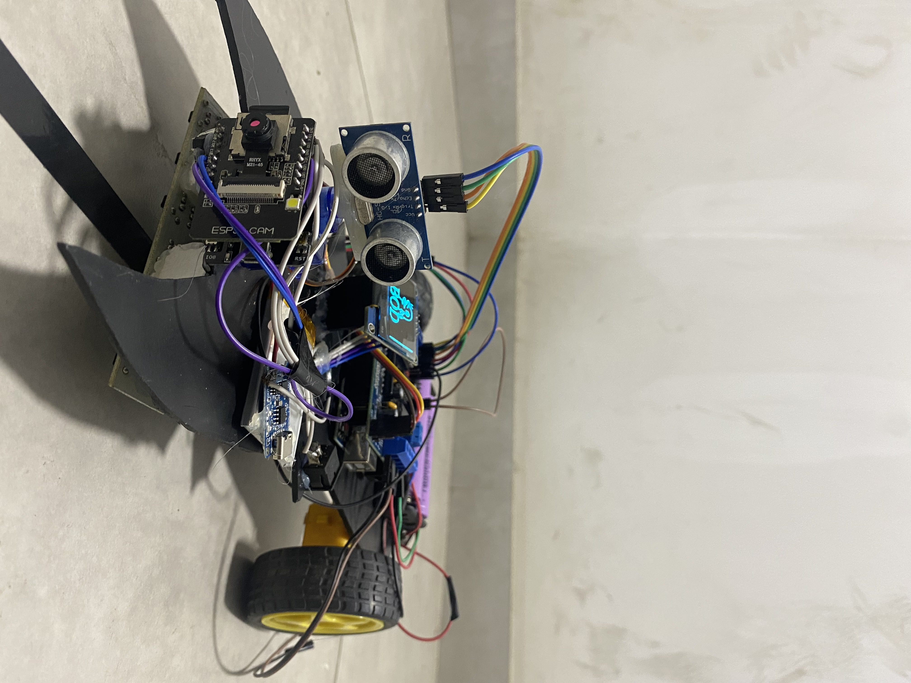

# 🤖 Batwave Object Detective Car (B.O.D.)

**A Line-Following Surveillance Robot with Object Detection, Alerts, and CCTV Recording**

---

## 🧠 Project Overview
The **Batwave Object Detective Car (B.O.D.)** is an autonomous surveillance robot designed for smart patrolling and monitoring.  
It integrates **IR sensors** for line-following, an **ultrasonic sensor** for obstacle detection, and an **ESP32-CAM module** for real-time video streaming and recording.  
Powered by dual batteries for efficient load management, B.O.D. combines **IoT**, **automation**, and **embedded systems** to create a portable, intelligent security robot.

---

## 🚗 Features
- 🔹 Autonomous line-following navigation using 6 IR sensors  
- 🔹 Object and obstacle detection via ultrasonic sensor  
- 🔹 Live camera feed and video recording through ESP32-CAM  
- 🔹 Efficient motor control using L293D driver and Arduino Uno  
- 🔹 Low-power, rechargeable dual-battery design  
- 🔹 Modular and educational platform for robotics and IoT learning  

---

## 🧩 System Components
| Component | Function |
|------------|-----------|
| Arduino Uno | Main control board |
| L293D Motor Driver | Controls two DC motors |
| IR Sensor Array (6x) | Line following |
| Ultrasonic Sensor | Obstacle detection |
| ESP32-CAM | Live video & recording |
| Li-ion Batteries | Power supply |
| DC Motors | Wheel movement |

---

## 🖼️ Prototype Images

  
  
  

*(Replace `images/BODFront.jpg`, etc., with your actual image paths.)*

---

## ⚙️ Working Principle
- IR sensors detect the line path and send signals to the Arduino Uno.  
- The Arduino adjusts motor speeds using L293D for accurate tracking.  
- Ultrasonic sensor detects obstacles and stops the robot when necessary.  
- ESP32-CAM records or streams footage during movement or detection events.  

---

## 🧾 Usage Instructions
1. Connect all components as per the circuit diagram.  
2. Upload the provided Arduino and ESP32 codes.  
3. Power the system with dual Li-ion batteries.  
4. Place the robot on a line track and start the test.  
5. View live feed via the ESP32-CAM web interface.  

---

## 🌍 Societal Impact
- Enhances security through low-cost automated surveillance.  
- Encourages innovation and learning in robotics and IoT.  
- Promotes sustainable smart systems with energy efficiency.  
- Supports safer, technology-driven communities.  

---

## 🧑‍💻 Authors
**H.M. Tahsin Sheikh**, **Shadman Sarwer**, **Humayra Jihan Arpita**  
Department of Computer Science and Engineering  
**University of Asia Pacific (UAP)**  

---

## 📜 License
This project is licensed under the **MIT License** – feel free to use and modify with credit.

